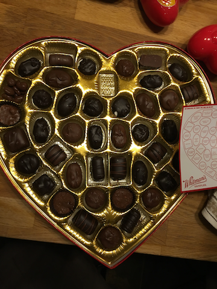

Spoil your Valentine with [Particle](https://www.particle.io) + [Spoil](https://spoil.co) + [AWS](https://aws.amazon.com/)
===

Instead of giving a box of chocolates this Valentines Day, keep the chocolates.  Lets give a smart self-gifting box instead!

Overview
===

We built a chocolate heart that gives endless gifts instead of candy!  A Particle Electron sends an order to 
Spoil.co on your behalf when the button is pressed!  We use Amazon SNS, and Lambda to catch our events and send the email.
  Lets get started!

Here's a guide on how we put it together!

 * [How we built the heart hardware](build/README.md)

 * [Setting up the SNS Topic to feed into Lambda](build/amazon/sns/README.md)
  
 * [How to configure this lambda function to send email](lambda_emailer/README.md)

 * [How to deploy the lambda function](build/amazon/lambda/README.md)

 * Setting up the webhook!
    * [Use IAM to get tokens for your webhook](build/amazon/iam/README.md)
    * [Setup your Particle Webhook to catch events from your heart](sns-webhook/README.md)
