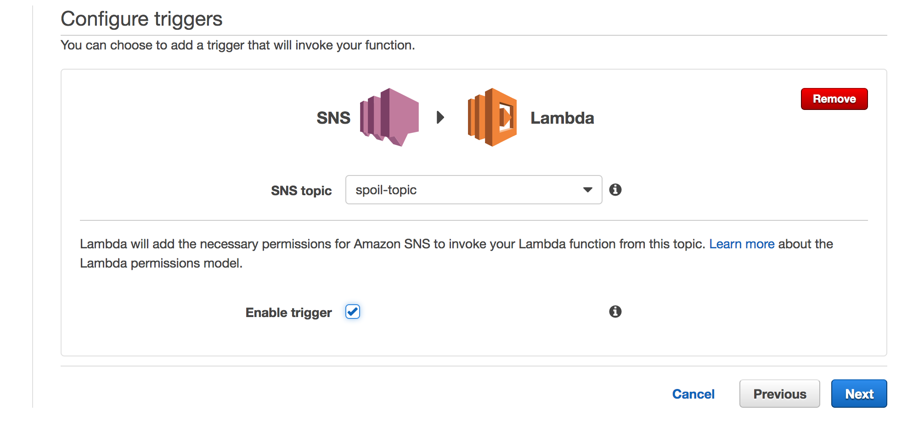
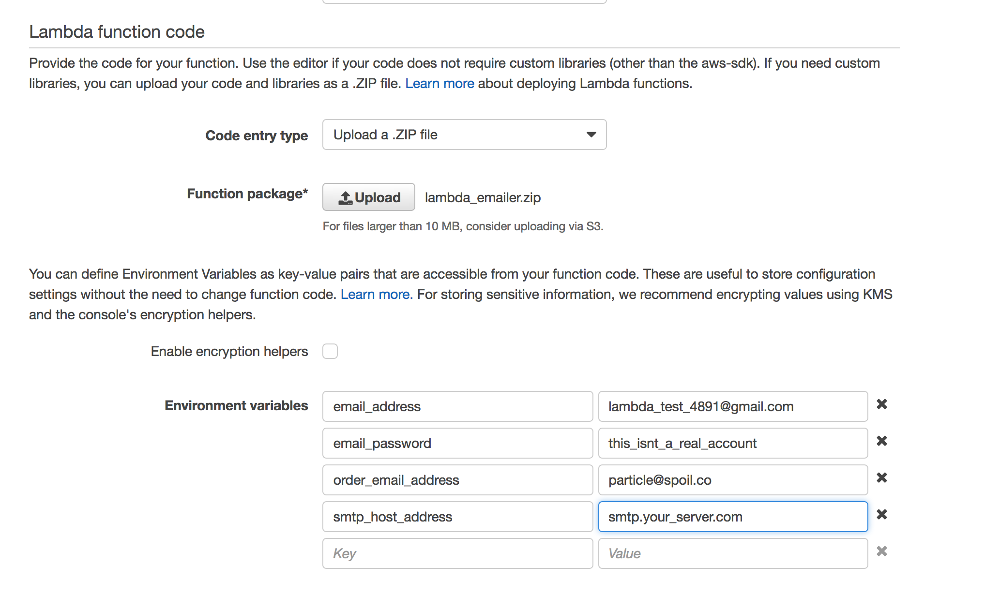
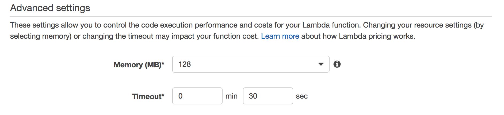
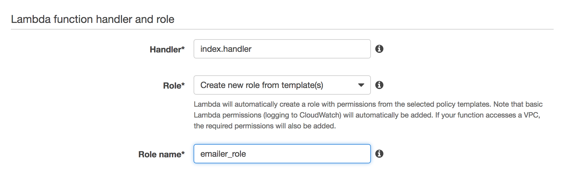

Deploying up the Lambda Function
===

Next lets create a [AWS Lambda function](https://console.aws.amazon.com/lambda/home), triggered off that new SNS Topic: 

setting environment variables

lets increase the timeout a bit as well, just in case the server is slow:

don't forget to give the role a name

